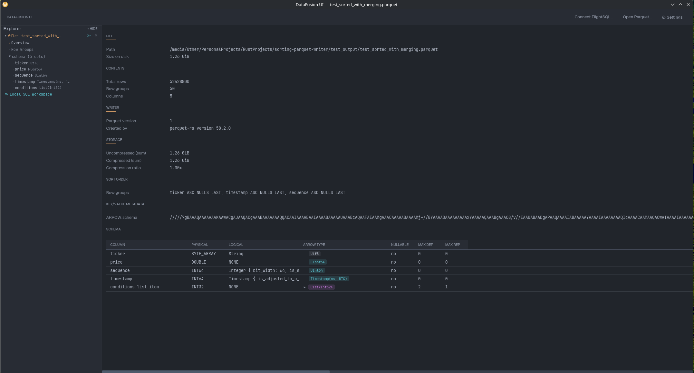
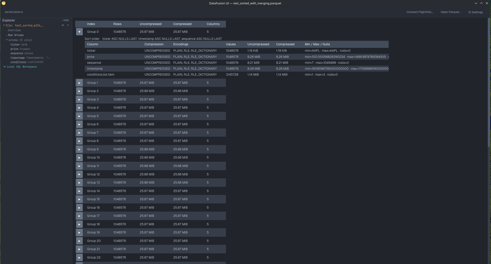
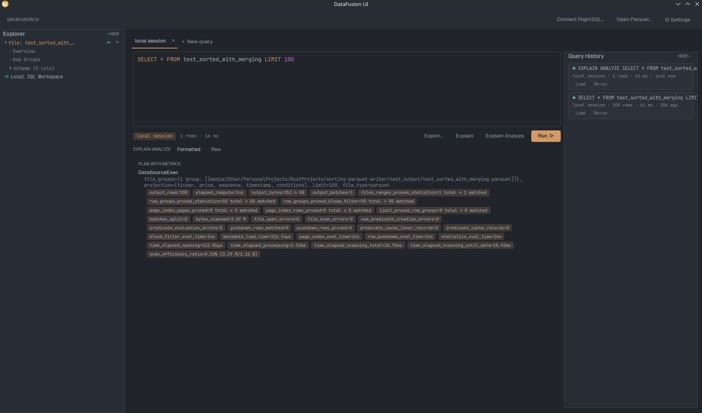
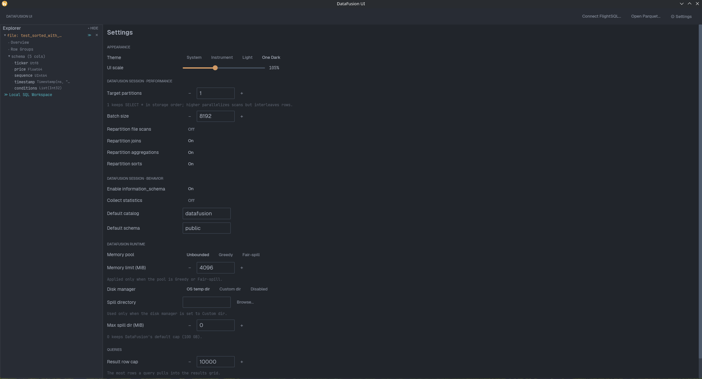

# datafusion-ui

A desktop UI for inspecting [Apache Parquet](https://parquet.apache.org/) files and querying [DataFusion](https://datafusion.apache.org/) / [FlightSQL](https://arrow.apache.org/docs/format/FlightSql.html) sources. Built in Rust with [`iced`](https://iced.rs/), [`arrow`](https://crates.io/crates/arrow), and [`parquet`](https://crates.io/crates/parquet).

Open one or more Parquet files, inspect their metadata, connect to FlightSQL servers, and explore everything through a SQL editor — all from a persistent object-explorer sidebar.

## Screenshots

| Overview | Row Groups |
|---|---|
|  |  |

| Explain Analyze | Settings |
|---|---|
|  |  |

## Features

### Explorer sidebar

A persistent panel listing every source:

- **Open files** — each expands to its **Overview** and **Row Groups** views plus a collapsible schema tree. A `≫` button opens a SQL editor seeded with `SELECT * FROM <table> LIMIT 100`.
- **FlightSQL connections** — each lazily loads a catalog → schema → table → column tree; `≫` opens a query editor bound to that connection, `ⓘ` shows connection health.
- **Local SQL Workspace** — the shared session every open file is registered into.

### SQL workspace

The primary way to look at data. A tabbed editor where each tab is bound to a source (the shared local session, or a FlightSQL connection):

- Syntax highlighting, **autocomplete** (tables, columns, keywords), and live syntax **diagnostics**, powered by the in-repo [`sql-ide`](crates/sql-ide) crate.
- Undo/redo, **Run** (Ctrl/Cmd+Enter), and **EXPLAIN** / **EXPLAIN ANALYZE** with a formatted plan view (toggle to the raw grid).
- **Export** the full (uncapped) result to Parquet, CSV, or JSON, with format options (compression, CSV header/delimiter, NDJSON).
- A persistent **query history** panel — load or re-run any past query. History is itself queryable as a `history` table.

### Results grid

The shared grid that renders every query result:

- A per-column **stats row**: distinct count, null share, min/max, a numeric histogram, and top values for low-cardinality columns — computed from the result set, so it works for both local files and FlightSQL.
- **Pagination** over the fetched rows, with first/prev/next/last controls.
- **Nested-cell expansion** — click a struct/list/map cell to open a tree view of its contents (copy as JSON).
- **Resizable columns** (double-click a handle to auto-fit); widths persist per schema.
- Click any scalar cell to copy its full value; horizontal + vertical scrolling for wide results.

### Per-file inspection

- **Overview** — file size, total rows, row group count, columns, writer (`created_by`), version, compressed/uncompressed bytes with a compression ratio, and any key/value file metadata.
- **Row Groups** — one row per row group with sizes and column counts; expand a group for per-column-chunk stats (compression, encodings, value count, sizes, min/max/null counts).

### Theming & settings

- **Themes**: a signature warm dark ("Instrument"), a light theme, and **One Dark** — or **System**, which follows the OS light/dark preference detected at startup.
- Adjustable **UI scale**.
- Tunable DataFusion **session** (target partitions, batch size, repartition flags, `information_schema`, statistics, default catalog/schema) and **runtime** (memory pool, disk/spill manager, result row cap).

Settings are persisted as TOML in the app directory (`~/.datafusion-ui/config.toml` by default).

## Build

Requires a recent Rust toolchain (edition 2024 — Rust 1.95+).

```sh
git clone https://github.com/wyatt-herkamp/datafusion-ui
cd datafusion-ui
cargo build --release
```

The binary lands at `target/release/datafusion-ui`.

## Run

```sh
# Empty window — use "Open Parquet…" or "Connect FlightSQL…"
cargo run --release

# Open a file directly
cargo run --release -- file /path/to/file.parquet

# Connect to a FlightSQL endpoint on launch
cargo run --release -- flight-sql http://localhost:50051

# Or after installing the binary:
datafusion-ui file /path/to/file.parquet
```

By default config and persistent state live in `~/.datafusion-ui`; override with `--app-dir <dir>` or the `DATAFUSION_UI_APP_DIR` environment variable.

## Install (Linux)

Install the binary somewhere on your `PATH`, then install the `.desktop` file so file managers list datafusion-ui as a handler for `.parquet` files.

```sh
# Binary
cargo build --release
install -Dm755 target/release/datafusion-ui ~/.local/bin/datafusion-ui

# Desktop entry
install -Dm644 packaging/datafusion-ui.desktop \
    ~/.local/share/applications/datafusion-ui.desktop

# Refresh the desktop database (some environments)
update-desktop-database ~/.local/share/applications 2>/dev/null || true
```

After this, right-clicking a `.parquet` file in your file manager should offer **Open with → DataFusion UI**, and you can make it the default with **Properties → Open With**.

To install system-wide instead, replace `~/.local/bin` with `/usr/local/bin` and `~/.local/share/applications` with `/usr/share/applications` (needs root).

## How it works

Opening a file reads its footer metadata up front (for Overview / Row Groups) and registers it as a named table in a shared DataFusion `SessionContext`. From then on, browsing the data is just SQL: the workspace runs your query against the shared session (or a FlightSQL connection) and renders the result in the grid. Results are capped at a configurable row limit and paginated client-side. Disk and network I/O run off the UI thread so the app stays responsive on large files.

## Workspace

This repo is a Cargo workspace. The GUI crate lives at the root; [`crates/sql-ide`](crates/sql-ide) is a standalone, GUI-agnostic SQL editing-support library (lexer, completion, diagnostics).

## License

Dual-licensed under MIT or Apache-2.0, at your option.
